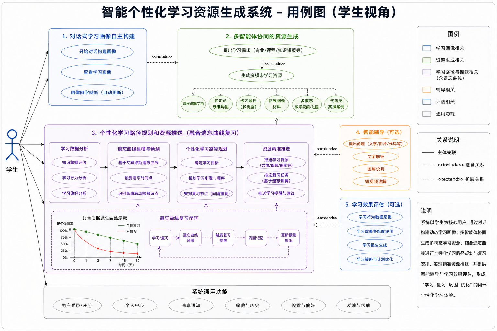
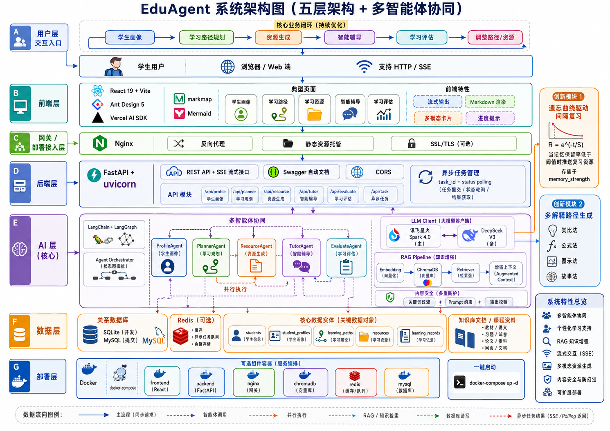
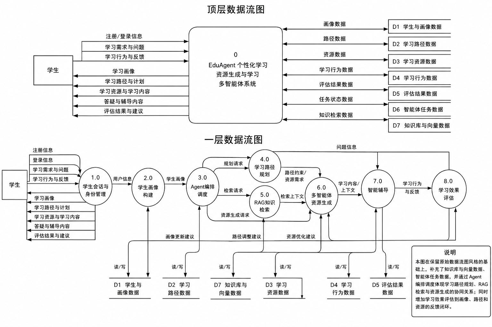
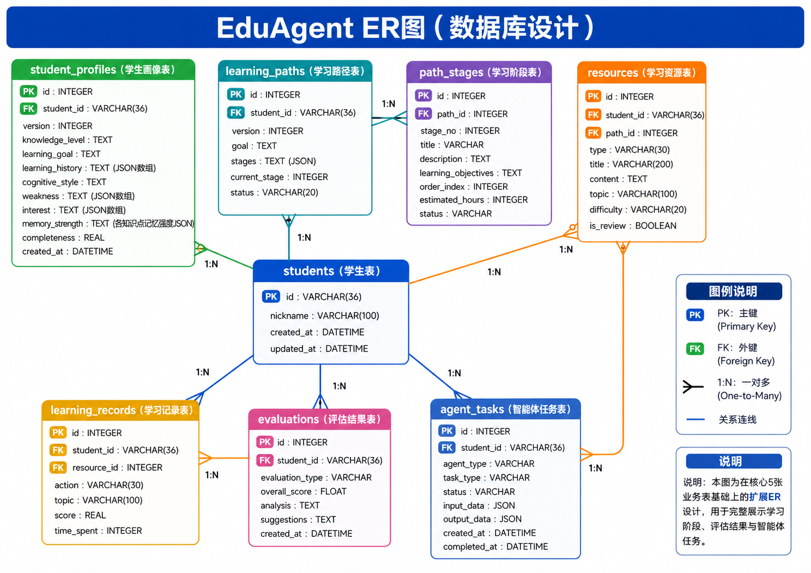
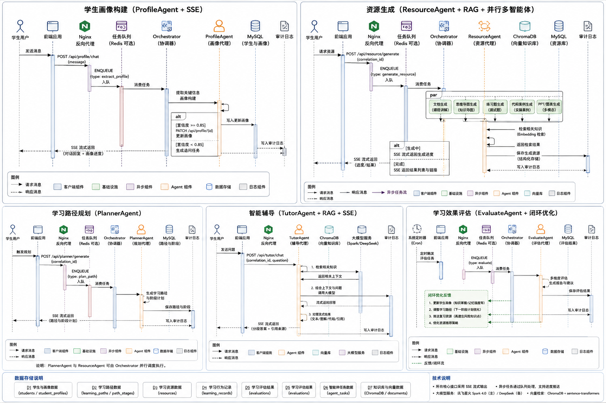

# 系统开发说明书

> **项目**：EduAgent — 基于大模型的个性化学习资源生成与学习多智能体系统
> **赛题**：第15届软件杯 A3 | 出题方：科大讯飞

---

## 1. 系统概述

### 1.1 项目定位

本项目构建基于大模型和多智能体协同的个性化学习资源智能体平台。系统围绕"学生画像 → 学习路径规划 → 资源生成 → 智能辅导 → 学习评估"的完整闭环，实现高等教育场景下的个性化学习支持。

### 1.2 核心功能

| 功能模块 | 说明 |
|----------|------|
| 对话式学生画像构建 | 通过自然语言对话获取学生信息，构建 6 维动态画像 |
| 多智能体协同资源生成 | Profile/Planner/Resource/Tutor/Evaluate 五个 Agent 协同工作 |
| 个性化学习路径规划 | 基于画像生成分阶段学习路径，支持动态调整 |
| 智能辅导问答 | 流式对话辅导，支持多模态回答（文本/图解/代码） |
| 学习效果评估 | 多维评估 + 反馈闭环，自动调整学习策略 |
| 多模态资源生成 | 课程文档、思维导图、练习题、代码案例、PPT、图表 |

### 1.3 用例图（学生视角）

下图展示了学生用户与本系统的核心交互场景，包括画像构建、路径规划、资源生成、智能辅导和学习评估五个主要用例。



*图 1-1：学生视角用例图。学生通过对话式画像构建初始化个人学习档案，随后系统生成个性化学习路径与配套资源。学生在学习过程中可随时进行智能问答，系统根据学习记录进行评估并动态调整学习计划。*

---

## 2. 系统架构

### 2.1 五层架构

```
┌─────────────────────────────────────────────────────────────┐
│  部署层                                                     │
│  Docker + docker-compose + Nginx                            │
├─────────────────────────────────────────────────────────────┤
│  前端层         React 19 + Vite + Ant Design 5              │
│               + Vercel AI SDK + markmap + Mermaid           │
├─────────────────────────────────────────────────────────────┤
│  后端层         FastAPI + uvicorn + SSE                     │
│               异步流式、Swagger 自动文档、CORS                │
├─────────────────────────────────────────────────────────────┤
│  AI 层          LangChain + LangGraph（Agent 编排）          │
│                + 讯飞星火 Spark 4.0 + ChromaDB + RAG        │
├─────────────────────────────────────────────────────────────┤
│  数据层         SQLite（开发）/ MySQL（提交）                 │
│                + Redis（缓存/异步任务，可选）                 │
└─────────────────────────────────────────────────────────────┘
```

### 2.2 技术架构图

```
浏览器 ──HTTP/SSE──▶ Nginx ──▶ FastAPI ──▶ AgentOrchestrator
                                              │
                    ┌──────────────────────────┼──────────────────────────┐
                    │              │           │           │              │
                    ▼              ▼           ▼           ▼              ▼
              ProfileAgent  PlannerAgent ResourceAgent TutorAgent EvaluateAgent
                    │              │           │           │              │
                    └──────────────┴───────────┴───────────┴──────┬───────┘
                                                                  │
                                                    ┌─────────────┴─────────────┐
                                                    ▼                           ▼
                                               LLMClient                   RAG Pipeline
                                          (星火/DeepSeek)              (ChromaDB + Embedding)
                                                    │                           │
                                                    ▼                           ▼
                                              SQLite/MySQL              知识库文档
```

### 2.2a 系统架构图



*图 2-1：系统整体架构图。系统采用五层架构设计——前端层（React + Ant Design）、后端层（FastAPI）、AI 层（LangGraph Agent 编排 + 讯飞星火 LLM + ChromaDB RAG）、数据层（SQLite/MySQL）和部署层（Docker + Nginx）。各层之间通过 HTTP/SSE 协议通信，数据从上到下逐层传递。*

### 2.3 数据流

```
1. 用户在前端输入 → POST /api/profile/chat (SSE)
2. FastAPI 路由 → ProfileAgent.run()
3. ProfileAgent 调用 LLMClient.chat_stream() → 讯飞星火 API
4. 流式返回画像 JSON → 存入数据库
5. PlannerAgent + ResourceAgent 并行执行
6. 生成学习路径 + 学习资源 → 推送给前端渲染
7. 用户触发 TutorAgent（问答）或 EvaluateAgent（评估）
8. 评估结果反馈 → 调整路径和资源 → 闭环
```



*图 2-2：顶层数据流图（Level 0）和一层数据流图（Level 1）。顶层 DFD 展示了系统与外部实体（学生用户）之间的数据交互——学生输入学习描述，系统返回画像、路径、资源和评估报告。一层 DFD 将系统分解为画像管理、路径规划、资源生成、智能辅导和学习评估五个核心处理模块，以及学生信息库、知识库和学习记录库三个数据存储。*

---

## 3. 技术选型

### 3.1 选型总表

| 层面 | 技术 | 版本 | 选型理由 |
|------|------|------|----------|
| **大模型（主）** | 讯飞星火 Spark | 4.0 | 赛题方是讯飞，使用星火有加分 |
| **大模型（备）** | DeepSeek | V3 | 国内好用、便宜、OpenAI 兼容接口 |
| **后端框架** | FastAPI | 0.115 | 原生异步、SSE 流式、自动 Swagger 文档 |
| **Agent 编排** | LangGraph | 0.2 | 状态图编排、条件分支、并行支持 |
| **LLM 调用** | LangChain | 0.3 | 统一 LLM 接口、Prompt 模板 |
| **前端框架** | React + Vite | 19 / 6 | 生态最大、AI 工具代码生成质量最高 |
| **UI 组件库** | Ant Design | 5.22 | 中文友好、组件丰富、业务组件现成 |
| **AI SDK** | Vercel AI SDK | 4.0 | 内置 useChat hook，5 行代码搞定流式对话 |
| **数据库** | SQLite → MySQL | - | SQLite 零配置开发，提交切 MySQL |
| **向量数据库** | ChromaDB | 0.5 | 最轻量，pip install 即用，无需 Docker |
| **嵌入模型** | sentence-transformers | 3.0 | paraphrase-multilingual-MiniLM-L12-v2 |
| **思维导图** | markmap | 0.18 | Markdown 列表直接渲染为思维导图 |
| **图表** | Mermaid.js | 11 | 文本生成流程图/时序图 |
| **PPT 生成** | python-pptx | 1.0 | 简单 PPT 生成，LLM 输出大纲即可 |
| **内容安全** | 关键词过滤 + Prompt 约束 | - | 双重过滤，无需额外服务 |
| **部署** | Docker + docker-compose | - | 评委一键启动 |

### 3.2 与赛题技术要求的对应

| 赛题要求 | 实现方式 |
|----------|----------|
| 大模型驱动 | 讯飞星火 Spark 4.0 为主力模型 |
| 多智能体协同 | LangGraph 状态图编排，5 个 Agent 并行协作 |
| 多模态生成 | Markdown + 思维导图(markmap) + 图表(Mermaid) + PPT(python-pptx) |
| 流式输出 | FastAPI SSE + Vercel AI SDK |
| 内容安全 | 双层过滤：敏感词库 + System Prompt 约束 |
| 防幻觉 | RAG 知识增强 + 来源标注 + Prompt 约束 |

---

## 4. 模块设计

### 4.1 后端模块

```
backend/
├── app.py                    主入口，注册路由和中间件
├── config.py                 配置管理（数据库URL、API Key等）
│
├── api/                      路由层 — 处理 HTTP 请求/响应
│   ├── profile_api.py        /api/profile/* 学生画像
│   ├── planner_api.py        /api/planner/* 学习路径
│   ├── resource_api.py       /api/resource/* 学习资源
│   ├── tutor_api.py          /api/tutor/* 智能辅导
│   ├── evaluate_api.py       /api/evaluate/* 学习评估
│   └── task_api.py           /api/task/* 异步任务状态
│
├── agents/                   AI 层 — 核心智能逻辑
│   ├── base_agent.py         Agent 基类（流式调用 + 重试 + 日志）
│   ├── llm_client.py         LLM 统一封装（星火 + DeepSeek 自动切换）
│   ├── profile_agent.py      学生画像 Agent
│   ├── planner_agent.py      学习规划 Agent
│   ├── resource_agent.py     资源生成 Agent
│   ├── tutor_agent.py        智能辅导 Agent
│   ├── evaluate_agent.py     学习评估 Agent
│   └── orchestrator.py       Agent 编排器（LangGraph 状态图）
│
├── rag/                      RAG 检索管线
│   ├── embedding.py          文本转向量
│   ├── vector_store.py       ChromaDB 操作封装
│   ├── retriever.py          检索逻辑
│   └── knowledge_loader.py   知识数据导入
│
├── models/                   数据模型层 — SQLAlchemy ORM
│   ├── student.py            Student + StudentProfile
│   ├── learning_path.py      LearningPath
│   ├── resource.py           Resource
│   └── evaluation.py         LearningRecord
│
├── services/                 业务逻辑层 — API 与 Agent 的桥梁
├── safety/                   内容安全
│   └── content_filter.py     敏感词 + 安全校验
└── utils/                    工具函数
    ├── logger.py             日志
    └── task_manager.py       异步任务管理
```

### 4.2 前端模块

```
frontend/src/
├── api/                      后端 API 调用封装
│   ├── client.js             axios 实例 + 基础配置
│   ├── profile.js            画像 API
│   ├── planner.js            规划 API
│   ├── resource.js           资源 API
│   ├── tutor.js              辅导 API
│   └── evaluate.js           评估 API
│
├── pages/                    页面组件
│   ├── ProfilePage.jsx       学生画像页（对话 + 画像卡片）
│   ├── LearningPathPage.jsx  学习路径页（时间线/步骤条）
│   ├── ResourcePage.jsx      学习资源页（资源卡片列表）
│   ├── TutorPage.jsx         智能辅导页（问答聊天界面）
│   └── EvaluatePage.jsx      学习评估页（进度 + 评分图表）
│
├── components/               可复用组件
│   ├── ChatBox.jsx           通用对话组件（流式显示）
│   ├── ProfileCard.jsx       画像卡片
│   ├── ResourceCard.jsx      资源卡片
│   ├── PathTimeline.jsx      学习路径时间线
│   ├── MindMapViewer.jsx     思维导图查看器（markmap）
│   ├── MermaidChart.jsx      图表渲染器（mermaid）
│   ├── MarkdownRenderer.jsx  Markdown 渲染器
│   ├── QuizCard.jsx          练习题卡片
│   └── ProgressBar.jsx       生成进度条
│
└── hooks/                    自定义 Hooks
    ├── useChat.js            对话 Hook（Vercel AI SDK）
    └── useTaskStatus.js      异步任务轮询 Hook
```

### 4.3 AI/RAG 模块（队员B）

```
backend/agents/               Agent 核心逻辑
├── profile_agent.py          System Prompt 设计 + 画像提取逻辑
├── planner_agent.py          学习路径生成逻辑
├── resource_agent.py         多类型资源生成逻辑
├── tutor_agent.py            多风格解释生成逻辑
└── evaluate_agent.py         多维评估 + 遗忘曲线计算

backend/rag/                  RAG 检索管线
├── embedding.py              文本 → 向量（sentence-transformers）
├── vector_store.py           ChromaDB CRUD 操作
├── retriever.py              语义检索 + 相似度排序
└── knowledge_loader.py       Markdown/JSON 知识数据导入

backend/safety/               内容安全
└── content_filter.py         敏感词过滤 + 输入输出校验
```

---

## 5. 数据库设计

### 5.1 ER 图（逻辑）

```
students 1 ──── * student_profiles    (一个学生多个画像版本)
students 1 ──── * learning_paths      (一个学生多个路径版本)
students 1 ──── * resources           (一个学生多个资源)
students 1 ──── * learning_records    (一个学生多条学习记录)
learning_paths 1 ──── * resources     (一个路径关联多个资源)
```



*图 5-1：数据库 ER 图。系统包含 5 张核心表：students（学生）与 student_profiles（画像）、learning_paths（学习路径）、resources（学习资源）、learning_records（学习记录）之间为一对多关系。student_profiles 中的 memory_strength 字段存储各知识点的记忆强度，支撑遗忘曲线驱动的间隔复习功能。*

### 5.2 表结构

#### students — 学生表

| 字段 | 类型 | 说明 |
|------|------|------|
| id | VARCHAR(36) PK | UUID |
| nickname | VARCHAR(100) | 学生昵称 |
| created_at | DATETIME | 创建时间 |
| updated_at | DATETIME | 更新时间 |

#### student_profiles — 学生画像表

| 字段 | 类型 | 说明 |
|------|------|------|
| id | VARCHAR(36) PK | UUID |
| student_id | VARCHAR(36) FK | 关联学生 |
| version | INTEGER | 画像版本号（动态更新+1） |
| knowledge_level | TEXT | 知识基础 |
| learning_goal | TEXT | 学习目标 |
| learning_history | TEXT | 学习历史（JSON 数组） |
| cognitive_style | TEXT | 认知风格 |
| weakness | TEXT | 薄弱点（JSON 数组） |
| interest | TEXT | 兴趣方向（JSON 数组） |
| memory_strength | TEXT | 各知识点记忆强度 JSON（创新点） |
| completeness | REAL | 画像完整度 0-1 |
| created_at | DATETIME | 创建时间 |

#### learning_paths — 学习路径表

| 字段 | 类型 | 说明 |
|------|------|------|
| id | VARCHAR(36) PK | UUID |
| student_id | VARCHAR(36) FK | 关联学生 |
| version | INTEGER | 路径版本号 |
| goal | TEXT | 学习总目标 |
| stages | TEXT | 阶段列表（JSON） |
| current_stage | INTEGER | 当前所在阶段 |
| status | VARCHAR(20) | active / completed / paused |

#### resources — 学习资源表

| 字段 | 类型 | 说明 |
|------|------|------|
| id | VARCHAR(36) PK | UUID |
| student_id | VARCHAR(36) FK | 关联学生 |
| path_id | VARCHAR(36) FK | 关联学习路径 |
| type | VARCHAR(30) | document / mindmap / exercise / code / reading / ppt |
| title | VARCHAR(200) | 资源标题 |
| content | TEXT | Markdown/JSON 内容 |
| topic | VARCHAR(100) | 知识点主题 |
| difficulty | VARCHAR(20) | 初级 / 中级 / 高级 |
| is_review | BOOLEAN | 是否复习推送（创新点） |

#### learning_records — 学习记录表

| 字段 | 类型 | 说明 |
|------|------|------|
| id | VARCHAR(36) PK | UUID |
| student_id | VARCHAR(36) FK | 关联学生 |
| resource_id | VARCHAR(36) FK | 关联资源 |
| action | VARCHAR(30) | view / complete / answer / ask |
| topic | VARCHAR(100) | 相关知识点 |
| score | REAL | 答题得分 0-1 |
| time_spent | INTEGER | 花费时间（秒） |

---

## 6. API 接口设计

### 6.1 接口总览

| 方法 | 路径 | 用途 | 响应方式 |
|------|------|------|----------|
| `GET` | `/` | 健康检查 | JSON |
| `POST` | `/api/profile/chat` | 对话式画像构建 | **SSE 流式** |
| `GET` | `/api/profile/{student_id}` | 获取学生画像 | JSON |
| `PUT` | `/api/profile/{student_id}` | 更新画像 | JSON |
| `POST` | `/api/planner/generate` | 生成学习路径 | **SSE 流式** |
| `GET` | `/api/planner/{student_id}` | 获取学习路径 | JSON |
| `POST` | `/api/resource/generate` | 生成学习资源 | 异步任务（返回 task_id） |
| `GET` | `/api/resource/{resource_id}` | 获取资源详情 | JSON |
| `GET` | `/api/resource/list` | 资源列表 | JSON |
| `POST` | `/api/tutor/chat` | 智能辅导问答 | **SSE 流式** |
| `POST` | `/api/evaluate/start` | 开始学习评估 | JSON |
| `GET` | `/api/evaluate/report/{student_id}` | 获取评估报告 | JSON |
| `POST` | `/api/evaluate/record` | 提交学习记录 | JSON |
| `GET` | `/api/task/{task_id}/status` | 查询异步任务进度 | JSON |

### 6.2 统一规范

- 所有接口前缀 `/api/`
- 流式接口统一 SSE，`Content-Type: text/event-stream`
- 异步任务返回 `task_id`，前端轮询 `/api/task/{id}/status`
- 普通成功响应统一格式：`{"success": true, "data": {}, "message": "ok"}`
- 错误响应统一格式：`{"success": false, "error": true, "code": "ERROR_CODE", "message": "描述"}`
- 学生 ID 使用 UUID，任务 ID 使用 `task_` 前缀
- 第一阶段普通 JSON 接口保留顶层业务字段作为旧前端兼容；正式合同以 `data` 内字段为准。

### 6.3 核心接口示例

#### 画像对话（SSE 流式）

```
POST /api/profile/chat

请求：
{
  "student_id": "stu_001",
  "message": "我是大二学生，在学机器学习，数学基础不太好..."
}

响应（SSE 流式）：
data: {"type":"chat","content":"了解了，你的数学基础..."}
...
data: {"type":"profile_update","profile":{...6个维度...}}
data: {"type":"done"}
```

#### 资源生成（异步任务）

```
POST /api/resource/generate
→ {"success":true,"data":{"task_id":"task_abc","status":"pending"},"message":"资源生成任务已创建"}

GET /api/task/task_abc/status
→ {"success":true,"data":{"status":"running","progress":60,"message":"正在生成练习题..."},"message":"ok"}

GET /api/task/task_abc/status
→ {"success":true,"data":{"status":"done","result":{"resources":[...]}},"message":"ok"}
```

---

## 7. Agent 设计

### 7.1 Agent 协同流程（LangGraph）

```
用户对话
    │
    ▼
ProfileAgent ── 构建/更新学生画像（6 维 + 遗忘曲线数据）
    │
    ├──────────┐
    ▼          ▼
PlannerAgent  ResourceAgent  ← 并行执行
生成路径      生成资源
    │          │
    └────┬─────┘
         ▼
    推送到前端
         │
    ┌────┴────┐
    ▼         ▼
TutorAgent  EvaluateAgent  ← 用户主动触发
即时问答     学习评估
               │
               ▼
         评估 → 调整路径/资源 → 闭环
```



*图 7-1：多 Agent 协同工作时序图。展示了学生用户从发起对话到获得学习资源的完整交互过程：(1) 学生在 ProfilePage 输入学习描述 → ProfileAgent 通过 LLM 分析并返回学生画像；(2) 画像就绪后 PlannerAgent 和 ResourceAgent 并行执行——前者生成学习路径，后者生成配套学习资源；(3) 结果推送到前端，学生可在 TutorPage 发起智能问答，或在 EvaluatePage 查看学习评估报告。整个过程采用 SSE 流式传输，保证交互的实时性。*

### 7.2 Agent 职责与输入/输出

| Agent | 职责 | 输入 | 输出 |
|-------|------|------|------|
| **ProfileAgent** | 对话式构建画像 | message, history, current_profile | chat_reply + profile(6维) |
| **PlannerAgent** | 生成学习路径 | profile, goal | goal + stages[] |
| **ResourceAgent** | 生成学习资源 | topic, types[], difficulty, profile | resources[] |
| **TutorAgent** | 智能辅导问答 | question, context, explanation_style | chat_response + diagrams + references |
| **EvaluateAgent** | 学习效果评估 | student_id, profile, records, path | overall_score + dimensions + suggestions |

### 7.3 防幻觉机制

在每个 Agent 的 System Prompt 中嵌入以下约束：

```
你是一个学术类 AI 助手，请遵守：
1. 只回答你确定的内容，不确定请标注"建议核实"
2. 公式、定理、年份等务必核实准确性
3. 超出知识范围请诚实告知
4. 不生成违规、敏感或不安全的内容
```

RAG 增强：生成内容附带"参考来源"，提升内容可信度。

---

## 8. 创新点设计

### 8.1 遗忘曲线驱动间隔复习

**核心算法**：
- 艾宾浩斯遗忘曲线公式：R = e^(-t/S)
  - R：记忆保留率
  - t：距上次学习的时间
  - S：相对记忆强度（随正确复习增加，错误减少）
- 每次学生学习/答题 → 记录时间戳 + 正确率 → 更新 S
- 当 R 降至阈值（0.6）以下 → 自动推送复习内容
- 存储于 `student_profiles.memory_strength` 字段

### 8.2 多解释路径生成

TutorAgent 支持 4 种解释风格切换：
- 类比法（analogy）：日常生活类比
- 公式法（formula）：数学公式推导
- 图示法（visual）：Mermaid 流程图可视化
- 故事法（story）：小故事串联知识点

实现方式：Prompt Engineering，在 System Prompt 中预设 4 种风格模板。

---

## 9. 内容安全设计

### 9.1 双重过滤机制

```
输入 → 关键词过滤 → LLM 生成 → Prompt 约束 → 输出过滤 → 返回
```

- **关键词过滤**：敏感词库匹配 → 拦截
- **Prompt 约束**：System Prompt 中限定安全边界
- **输出校验**：检查生成内容是否包含违规信息

### 9.2 敏感词库

维护一个基础敏感词列表，在 `content_filter.py` 中实现：
- 政治敏感词过滤
- 暴力/色情内容过滤
- 学术不端行为过滤（如代写论文请求）

---

## 10. 开发计划与协作约定

### 10.1 人员分工

本计划与 `prepare.md`、`github-workflow.md`、`test_plan.md` 保持一致：团队共 3 人。Day 1-5 保持原计划，用于完成项目骨架、画像构建、学习路径规划和画像到路径的端到端联调；从当前 Day 6 开始，将原 Day 6-24 的剩余工作压缩到 Day 6-16 完成。任务量不减少，但每天必须明确交付物和跨成员对接项。

| 角色 | 分支 | 负责范围 | 核心交付物 |
|------|------|----------|----------|
| 队长 | `feature/backend-core` | 后端 API、数据库模型、AgentOrchestrator、LLMClient、异步任务、Docker 集成、项目进度 | FastAPI 全部端点、统一接口规范、数据库表、Docker Compose、最终集成包 |
| 队员A | `feature/frontend-core` | 前端全部页面、组件、SSE 流式展示、Markdown/Mermaid/markmap 渲染、交互体验 | React 页面、API 调用封装、通用组件、前端联调截图、页面回归结果 |
| 队员B | `feature/ai-core` | Agent 核心逻辑、Prompt、RAG、知识库、内容安全、AI 输出质量测试 | 5 个 Agent、RAG 管线、知识库样例、内容过滤、AI 输出样例和测试用例 |

### 10.2 每日任务与交付物

Day 1-5 不再重新排期，只做完成情况确认；Day 6-Day 16 是比赛冲刺排期。每天结束时必须能拿出“可运行功能 + 页面截图 + 接口/测试证据 + 对接记录”，不能只提交半成品代码。

#### 10.2.1 Day 1-5 完成情况确认

| 天数 | 原定目标 | 当前完成判断 | 还需补齐的证据 |
|------|----------|--------------|----------------|
| Day 1 | 前后端项目骨架、三条功能分支、接口草案 v0.1 | 已具备 FastAPI、React、Agent、RAG、测试目录结构 | 保留前后端启动截图、Swagger 首页截图 |
| Day 2 | 数据库基础、画像页面静态结构、ProfileAgent Prompt 样例 | 已具备数据库脚本、ProfilePage、ProfileAgent、画像测试 | 补充画像样例 JSON 到测试报告或截图目录 |
| Day 3 | 画像 SSE 接口、ChatBox、ProfileCard、6 维画像输出 | 已具备 `/api/profile/*`、ChatBox、ProfileCard、ProfileAgent | 保留一次画像对话截图和接口返回样例 |
| Day 4 | 学习路径接口、LearningPathPage、PathTimeline、PlannerAgent | 已具备 `/api/planner/*`、LearningPathPage、PathTimeline、PlannerAgent | 保留路径页面截图和路径 JSON 样例 |
| Day 5 | Orchestrator 串联画像到路径，前端接真实接口 | 已具备 AgentOrchestrator 和画像 -> 路径主流程代码 | Day 6 复测 `pytest test -q`，并保留通过结果 |

#### 10.2.2 Day 6-Day 16 每日冲刺任务

| 天数 | 当天必须达到的效果 | 队长：后端 + 集成 | 队员A：前端页面效果 | 队员B：AI/RAG + 安全 | 当天交付物 | 必须对接完成 |
|------|------------------|------------------|-------------------|---------------------|------------|--------------|
| Day 6 | 学生能在“学习资源”页面输入主题并看到 3 类基础资源卡片 | 创建 `resources` 表和 Resource 模型；实现 `POST /api/resource/generate` 同步初版；响应包含 `resources[]`、`type`、`title`、`topic`、`difficulty`、`content`；补齐失败返回 `RESOURCE_GENERATE_FAILED` | `ResourcePage` 有主题输入框、难度选择、资源类型选择、生成按钮；生成后展示 document、exercise、code 三张 `ResourceCard`；Markdown 内容能正常渲染，空状态提示“暂无资源，先输入主题生成” | `ResourceAgent` 输出 document、exercise、code 三类资源；每类资源不少于标题、适用知识点、正文、练习或代码；准备“机器学习入门”样例输出 | 资源接口 Swagger 截图；资源页面生成前/生成后截图；3 组 Agent 输出 JSON；`pytest test -q` 通过截图或日志 | 队长 + 队员B 确认 ResourceAgent JSON Schema；队长 + 队员A 确认 ResourceCard 展示字段；队员A + 队员B 确认 Markdown/代码块格式 |
| Day 7 | 学生点击生成后能看到任务进度，长任务不再卡死页面 | 实现 `task_manager`；实现 `GET /api/task/{task_id}/status`；`/api/resource/generate` 返回 `task_id`；任务状态包含 `pending/running/done/failed`、`progress`、`message`、`result`；封装 LLMClient 超时、重试、降级文案 | `ResourcePage` 接入 `useTaskStatus`；点击生成后按钮禁用，显示 `ProgressBar` 和阶段文案；任务完成后自动替换为资源卡片；失败时显示重试按钮 | 增加 reading、mindmap、ppt_outline 资源 Prompt；完成 embedding、vector_store、retriever 最小可用骨架；知识库能加载 `data/knowledge` 中的 Markdown | 异步任务接口截图；资源生成进度从 0 到 100 的页面截图；RAG 加载日志；任务失败重试截图 | 队长 + 队员A 确认任务状态枚举和轮询间隔；队长 + 队员B 确认 LLMClient 调用入参；队员A + 队员B 确认 mindmap/ppt_outline 前端展示格式 |
| Day 8 | 学生能在“智能辅导”页面流式提问，并看到引用知识点和多解释答案 | 实现 `POST /api/tutor/chat` SSE；接入 retriever 检索结果；SSE 事件包含 `start/delta/data/error/done`；补齐 tutor 接口错误码和 Swagger 示例 | `TutorPage` 左侧为对话区，右侧为参考知识点/图表区；回答逐字流式出现；支持切换解释风格：类比、公式、图解、故事；Mermaid 图能正常显示，失败时有降级文本 | `TutorAgent` 支持 analogy、formula、visual、story 四种解释；输出 `answer`、`explanation_style`、`references`、`diagrams`；RAG 检索至少返回标题、片段、来源文件 | Tutor SSE 事件日志和连续截图；4 种解释风格样例；RAG references JSON；Mermaid 渲染截图 | 队员B + 队长 确认 references 字段和 diagrams 字段；队长 + 队员A 确认 SSE 事件处理；队员A + 队员B 确认 Mermaid 文本可渲染 |
| Day 9 | 学生完成学习后能提交记录，系统生成评分、薄弱点和复习计划 | 创建 `learning_records` 表；实现 `POST /api/evaluate/record`、`POST /api/evaluate/start`、`GET /api/evaluate/report/{student_id}`；报告保存到数据库；接口返回 `overall_score`、`dimensions`、`weak_topics`、`suggestions`、`review_plan` | `EvaluatePage` 有学习记录表单、测评入口、评分雷达图/维度条、薄弱知识点列表、复习计划时间线；没有报告时显示引导；生成报告时有加载态 | `EvaluateAgent` 输出评分、薄弱点、建议；实现遗忘曲线初版：根据掌握度和时间生成 `review_plan`；准备 3 个学生评估样例 | 评估接口 Swagger 截图；EvaluatePage 空状态/生成中/报告态截图；review_plan 样例 JSON；遗忘曲线说明小节 | 队长 + 队员B 确认 EvaluateAgent 输出和 review_plan 算法字段；队长 + 队员A 确认雷达图/时间线数据结构；队员A + 队员B 确认薄弱点中文展示 |
| Day 10 | 系统具备比赛可展示的安全、错误处理和创新点初版 | 统一所有接口成功/失败格式；补齐 Swagger 示例；完成画像、路径、资源、任务、问答、评估接口第一轮测试；接口失败必须返回明确 `code` 和 `message` | 全站补齐空状态、加载骨架、错误提示、重试按钮；清理核心流程 Mock 依赖；导航中五个主流程入口清晰可见 | 完成 `content_filter`；补充防幻觉 Prompt 约束；安全拦截敏感输入，RAG 无依据时明确提示“资料库中未找到可靠依据”；完成 Agent 单测和安全测试 | API 测试清单；错误态页面截图；安全拦截图；创新点初版说明：遗忘曲线 + 多解释路径 | 全员统一错误码表；队长 + 队员A 确认前端错误文案；队长 + 队员B 确认安全拦截返回格式和防幻觉边界 |
| Day 11 | 五大主流程可以从首页连续运行，不需要手动改数据 | 打通一条固定测试学生数据；修复画像 -> 路径 -> 资源 -> 问答 -> 评估的字段和数据库问题；保留 E2E 手工测试步骤 | 首页展示“开始画像/查看路径/生成资源/智能辅导/学习评估”五个入口；页面之间跳转顺畅；每个页面都能用真实 API 完成核心动作 | 调优知识库召回；补充 AI 输出样例；把不稳定 Prompt 收敛成固定模板；记录常见失败和降级策略 | 一份完整 E2E 手工测试步骤；五流程截图；P0/P1 问题清单；核心流程不依赖 Mock 的确认记录 | 全员一起跑一次完整主流程；队长记录问题和负责人；队员A 标注页面问题；队员B 标注输出质量问题 |
| Day 12 | 系统响应速度和稳定性达到连续使用水平 | 优化 SSE 首字延迟、异步任务进度、LLM 超时重试；执行并发资源生成测试；关闭 P0/P1 后端问题 | 适配 1366x768 屏幕和手机宽度；按钮、卡片、图表不重叠；加载骨架和进度提示自然；关键页面截图稳定 | 做内容质量测试、安全测试、RAG 相关性测试；修正低质量输出 Prompt；补齐知识库缺口 | 性能测试记录；兼容性截图；RAG 命中样例；已关闭问题清单 | 队长 + 队员A 对接慢页面和接口耗时；队长 + 队员B 对接慢调用和低质量输出；全员确认 P0 清零 |
| Day 13 | 系统可以在一台新机器上完整启动，前后端、数据库、知识库都能连通 | 配置 Docker Compose 或一键启动脚本；完成数据库初始化和种子数据导入；统一环境变量读取；启动后 `/docs`、`/api/health`、五大业务接口均可访问 | 修复构建错误；确认 `npm run build` 通过；前端通过环境变量读取后端地址；所有页面刷新后不白屏，路由能正常恢复 | 确认知识库加载流程可重复执行；向量库不存在时自动初始化；RAG 检索失败时有降级结果；安全过滤模块随后端启动加载 | 一键启动成功记录；后端健康检查结果；前端构建结果；数据库表和种子数据检查结果；RAG 初始化日志 | 队长 + 队员A 确认前端构建产物和后端地址配置；队长 + 队员B 确认知识库初始化时机和失败降级；全员在同一启动方式下跑通系统 |
| Day 14 | 五大功能进入技术冻结：接口字段、页面交互、Agent 输出结构不再随意变更 | 锁定 API Schema；修复 P0/P1 后端缺陷；补齐自动化测试中缺失的接口用例；保证重复运行测试不会污染数据库 | 锁定页面交互和组件字段；修复 P0/P1 前端缺陷；清理残留 Mock；确保画像、路径、资源、问答、评估页面只消费真实接口或明确降级数据 | 锁定 Profile/Planner/Resource/Tutor/Evaluate 五个 Agent 输出结构；修复低质量输出和解析失败问题；补齐 RAG、安全、Prompt 的单元测试 | API Schema 冻结表；P0/P1 缺陷关闭记录；前端无 Mock 检查结果；Agent 输出结构样例；自动化测试通过记录 | 队长同步冻结字段；队员A 按冻结字段做最后适配；队员B 按冻结字段修正 Agent 输出；字段变更必须三人同时确认 |
| Day 15 | 全流程技术回归通过：从注册/登录到画像、路径、资源、问答、评估可以连续跑完 | 执行接口回归、集成回归和并发测试；修复剩余 P1/P2 后端问题；检查日志中无未处理异常；确认异步任务失败可恢复 | 执行桌面端和移动端页面回归；确认表单校验、加载态、错误态、重试态都可用；修复布局错位、按钮不可点、图表不渲染等问题 | 执行 Agent 质量回归；确认 RAG 引用可追溯；确认安全拦截不会误伤正常学习问题；优化慢 Prompt 和不稳定输出 | 回归测试结果；接口成功/失败样例；前端关键流程截图；RAG 命中率抽查结果；剩余缺陷列表 | 全员按同一测试账号跑完整流程；队长记录后端问题；队员A 记录页面问题；队员B 记录 AI 输出问题并当天关闭高优先级项 |
| Day 16 | 技术版本达到可提交状态：代码可运行、测试可通过、主要流程无阻断问题 | 生成最终技术版本；确认 `.env.example` 完整且无真实密钥；确认数据库迁移/初始化可重复；执行最终 `pytest test -q` 和接口冒烟测试 | 执行最终 `npm run build`；确认生产构建页面可访问；检查移动端和 1366x768 屏幕下无明显遮挡、溢出、白屏 | 执行最终 Agent/RAG/安全冒烟测试；确认知识库文件齐全；确认无联网依赖时系统有可解释降级；确认创新点功能在页面可被触发 | 最终代码版本；后端测试通过结果；前端构建通过结果；五大流程冒烟结果；已知问题清单只剩非阻断项 | 全员共同跑最终技术验收；队长负责后端和启动链路；队员A 负责页面可用性；队员B 负责 AI 输出、RAG、安全和创新点可用性 |

#### 10.2.3 每天结束前必须提交的技术证据

- 代码：当天功能分支提交，commit 信息说明具体功能，例如 `feat: 完成资源异步生成进度展示`。
- 页面证据：至少 2 张运行截图，包含“功能操作前”和“功能完成后”；涉及流式输出或进度条时补 1 张过程截图。
- 接口证据：Swagger、Postman、curl 或测试日志至少保留一种；当天新增接口必须有成功样例和失败样例。
- 对接记录：日报里写清楚“今天和谁对接了什么字段/页面/Prompt，结论是什么，是否还有阻塞”。
- 问题清单：P0/P1/P2 分级，必须写负责人和计划关闭日期。

### 10.3 协作流程

- 每天开始写代码前，三人都先切到 `main` 拉取最新代码，再切回自己的功能分支并合并 `main`。
- 每天结束前提交日报，格式为：`已完成 / 今日交付物 / 遇到问题 / 需要谁配合 / 明日计划`。
- 队长负责合并 PR 和维护主分支稳定；队员A、队员B完成阶段功能后向 `main` 提交 PR。
- 提交信息使用 `feat:`、`fix:`、`refactor:`、`docs:` 前缀，例如 `feat: 完成TutorAgent流式问答功能`。
- 前后端联调以 Swagger、SSE 示例和本章接口规范为准；字段变更必须先在群里确认，再同步更新设计文档。
- AI 输出结构由队长和队员B先确认 JSON Schema，队员A只消费稳定字段；临时字段不得直接进入页面逻辑。
- 测试安排遵循 `test_plan.md`：Day 6-8 做 Agent 单元测试，Day 9-10 做接口测试，Day 11-12 做集成和性能测试，Day 13-16 做部署启动、技术冻结、全流程回归和最终技术验收。

### 10.4 接口统一约定

#### 10.4.1 请求与响应格式

- 所有后端接口统一以 `/api/` 开头。
- 普通接口返回 JSON，流式接口使用 SSE。
- 所有请求体和响应体字段使用 `snake_case`，前端展示时再转换为中文文案。
- 时间字段统一使用 ISO 8601 字符串，例如 `2026-06-07T10:30:00+08:00`。
- ID 字段统一使用字符串，学生 ID 使用 UUID，任务 ID 使用 `task_` 前缀。
- 前端请求封装统一放在 `frontend/src/api/`，后端路由统一放在 `backend/api/`，Agent 输出结构统一由 `backend/agents/` 维护。

成功响应统一格式：

```json
{
  "success": true,
  "data": {},
  "message": "ok"
}
```

错误响应统一格式：

```json
{
  "success": false,
  "error": true,
  "code": "ERROR_CODE",
  "message": "错误描述"
}
```

#### 10.4.2 SSE 事件格式

流式接口统一返回以下事件类型：

| type | 用途 | 示例 |
|------|------|------|
| `start` | 任务开始 | `{"type":"start","message":"开始生成"}` |
| `delta` | 文本增量 | `{"type":"delta","content":"本节内容..."}` |
| `progress` | 进度更新 | `{"type":"progress","progress":0.5,"message":"正在检索知识库"}` |
| `data` | 结构化结果 | `{"type":"data","data":{...}}` |
| `error` | 流式错误 | `{"type":"error","code":"LLM_ERROR","message":"模型调用失败"}` |
| `done` | 任务完成 | `{"type":"done"}` |

SSE 示例：

```text
data: {"type":"start","message":"开始生成学习路径"}
data: {"type":"delta","content":"第一阶段：数学基础补强"}
data: {"type":"data","data":{"stages":[...]}}
data: {"type":"done"}
```

#### 10.4.3 Agent 输出结构约定

| Agent | 必须输出字段 | 说明 |
|-------|-------------|------|
| ProfileAgent | `student_id`, `profile`, `completeness`, `next_questions` | `profile` 包含知识基础、目标、历史、风格、薄弱点、兴趣 6 维 |
| PlannerAgent | `goal`, `stages`, `current_stage`, `estimated_days` | `stages` 中每项包含 `title`、`objectives`、`topics`、`tasks` |
| ResourceAgent | `resources` | 每个资源包含 `type`、`title`、`topic`、`difficulty`、`content` |
| TutorAgent | `answer`, `explanation_style`, `references`, `diagrams` | `diagrams` 可为空数组，图表内容使用 Mermaid 文本 |
| EvaluateAgent | `overall_score`, `dimensions`, `weak_topics`, `suggestions`, `review_plan` | `review_plan` 用于驱动复习推荐 |

#### 10.4.4 联调验收标准

- Swagger 能显示所有接口，且请求示例可直接运行。
- 前端页面不依赖假数据即可完成主流程演示。
- Agent 输出必须是可解析 JSON；若模型输出异常，后端需要返回统一错误格式。
- 每个接口至少保留 1 个成功样例和 1 个失败样例。
- Docker 启动后，评委只需访问前端地址即可完成画像、路径、资源、问答、评估五个核心流程。

---

## 11. 部署方案

### 11.1 Docker Compose

```yaml
services:
  frontend:    # React build + Nginx
  backend:     # FastAPI + uvicorn
  chromadb:    # 向量数据库（可选独立部署）
  # MySQL 和 Redis 按需添加
```

### 11.2 评委启动方式

```bash
# 一键启动
docker-compose up -d

# 访问
前端：http://localhost:3000
后端 API 文档：http://localhost:8000/docs
```

### 11.3 降级方案

如果 Docker 有问题，提供手动启动脚本：
- `start.sh`（Linux/Mac）
- `start.bat`（Windows）

---

## 12. 开源合规

| 依赖 | 协议 |
|------|------|
| FastAPI | MIT |
| LangChain / LangGraph | MIT |
| ChromaDB | Apache 2.0 |
| React / Vite | MIT |
| Ant Design | MIT |
| Vercel AI SDK | Apache 2.0 |
| sentence-transformers | Apache 2.0 |
| SQLAlchemy | MIT |
| python-pptx | MIT |
| Mermaid | MIT |
| markmap | MIT |

> 所有依赖均为 MIT 或 Apache 2.0 协议，可自由使用。详见 README.md 开源致谢部分。
